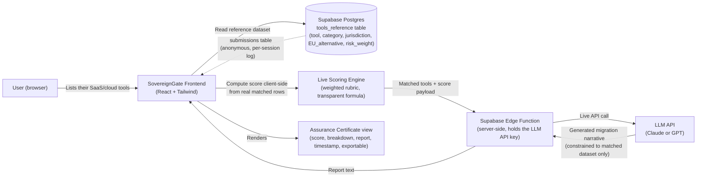

# SovereignGate

**An AI-powered Digital Sovereignty Assurance tool for European companies.**

SovereignGate takes the list of software and cloud tools a company actually uses, matches every tool against a curated reference dataset of jurisdictions, sub-processors, and verified EU alternatives, and returns three things: a transparent Digital Sovereignty Score, a live AI-generated migration report, and a downloadable Assurance Certificate.

**Live app:** https://euro-sovereign-scan.lovable.app

---

## What it does

1. A user lists the tools their company runs on (e.g. `AWS, Slack, Google Workspace, HubSpot`).
2. Every tool is matched against a real, curated reference database — not a hardcoded list in the frontend — of category, jurisdiction, risk weight, and a verified EU alternative.
3. A transparent, weighted scoring engine computes an overall **Sovereignty Score out of 100**, broken down by category: Cloud, Email, AI/LLM, Communications, CRM. The formula itself is shown on screen — nothing is a hidden black box.
4. A server-side call to an LLM generates a plain-language **Assurance Report**, explaining the top priority migrations and why — constrained to only recommend tools that exist in the verified dataset, so it can't invent a vendor that doesn't exist.
5. A timestamped, exportable **Digital Sovereignty Assurance Certificate** is issued — something a company could genuinely keep in a compliance folder or a procurement bid, not just a decorative results screen.

Every score and report is computed live, per submission — there are no pre-filled example results anywhere in the app.

---

## Why this exists

Most European companies cannot quickly answer a basic question about themselves: how dependent are they, right now, on non-EU cloud and software providers? The tools that exist to help with this today are static directories — useful, but they require the user to already know what they're looking for, and they give the same flat list to everyone regardless of their actual stack. SovereignGate is personalized, scored, and prioritized instead of just being a lookup table.

This is a decision-support tool, not legal advice, and the reference dataset is intentionally curated and expected to grow over time rather than being exhaustive on day one.

---

## Architecture



**Component summary**

| Layer | Technology | Responsibility |
|---|---|---|
| Frontend | React, TypeScript, Tailwind CSS | UI, input handling, client-side score computation from matched rows, rendering results and certificate |
| Database | Supabase (Postgres) | `tools_reference` table (curated dataset: tool, category, jurisdiction, EU alternative, risk weight, source note); `submissions` table (anonymous per-scan log) |
| Backend logic | Supabase Edge Function | Receives the matched-tool payload, calls the LLM API server-side (API key never exposed to the browser), returns the generated report |
| AI | LLM API (Claude / GPT) | Generates the plain-language Assurance Report, constrained to the verified dataset so it cannot recommend a nonexistent alternative |

---

## Tech stack

- React + TypeScript
- Tailwind CSS
- Supabase (Postgres + Edge Functions)
- LLM API (server-side call only)
- Deployed as a managed web application

---

## Getting started (local development)

### Prerequisites

- [Node.js](https://nodejs.org/) and npm — install via [nvm](https://github.com/nvm-sh/nvm#installing-and-updating) if you don't already have them
- A [Supabase](https://supabase.com/) project (for the database and Edge Function)
- An API key for your chosen LLM provider (used only inside the Edge Function, never in the frontend)

### Setup

```sh
# Clone the repository
git clone <this-repository-url>
cd <repository-name>

# Install dependencies
npm i

# Configure environment variables
# Create a .env file with your Supabase project URL and anon key:
# VITE_SUPABASE_URL=your-supabase-project-url
# VITE_SUPABASE_ANON_KEY=your-supabase-anon-key

# Run the development server
npm run dev
```

### Database setup

In your Supabase project, create the two tables the app depends on:

**`tools_reference`**

| Column | Type | Notes |
|---|---|---|
| `tool_name` | text | e.g. "AWS", "Slack" |
| `category` | text | Cloud / Email / AI-LLM / Communications / CRM |
| `jurisdiction` | text | Country/region the provider operates under |
| `eu_alternative` | text | Verified EU-based alternative |
| `risk_weight` | numeric | Used by the scoring formula |
| `source_note` | text | Where the jurisdiction/alternative claim comes from |

**`submissions`**

| Column | Type | Notes |
|---|---|---|
| `id` | uuid | Primary key |
| `submitted_tools` | text[] / jsonb | The tool list a user submitted |
| `computed_score` | numeric | The resulting Sovereignty Score |
| `created_at` | timestamp | Auto-set on insert |

### Edge Function

The report-generation Edge Function must:
- Accept the matched-tool payload from the frontend
- Call the LLM API using a key stored in the function's server-side environment/secrets — never in frontend code or committed to the repo
- Return the generated report text to the frontend

---

## Scope and limitations

- The reference dataset is curated, not exhaustive, and will expand over time.
- This tool provides decision support, not legal, compliance, or regulatory advice.
- Scoring weights are intentionally transparent and shown in-app rather than hidden — see the "How Scoring Works" page in the live app for the full explanation.

---

## Live app

https://euro-sovereign-scan.lovable.app
